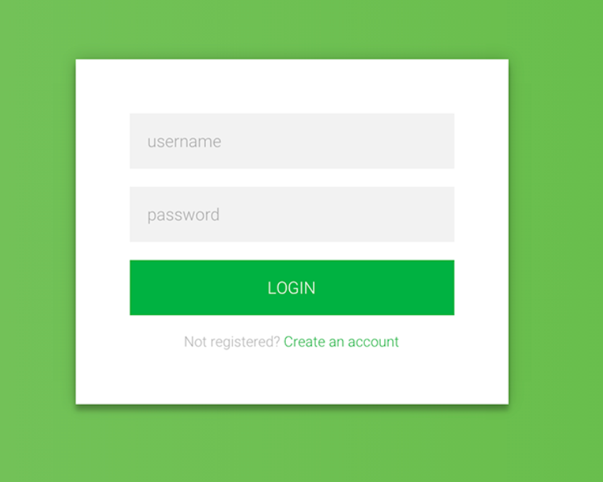
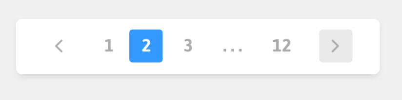

## Homework 3

In this assignment we will start to use React components. The goal of this assignment is to compose generic smaller components into larger more complex components. You will have to think about the information passed (props) from the larger components down to their child components. The components we will be creating are a login form, pager, and radio buttons. Below are some examples of how these might look:

  1. Login form example 
  
  

  2. Pager example
  
  

  3. Radio buttons example
  
  

## Deliverables

1. Layout the login form, pager, and radio buttons by composing generic components that will be located in `src/components`.
2. Figure out what props you want to pass down to each component. Example: let's say we created a button component some props that I might pass down could be a enable/disable flag, a way to change the color, and maybe a button size. 
3. Feel free to add custom styling and new generic components.
4. Deploy your app using whatever method you want (e.g. Github Pages, AWS, ect) and insert the url here: URL_TO_PROJECT

## How to run the project

It is required that you have `node` and `npm` installed. In the project directory, you will run:

`npm i`

to install. And then run

`npm start`

to run the app in the development mode. Open [http://localhost:4000](http://localhost:4000) to view it in the browser.

The page will reload if you make edits. You will also see any lint errors in the console.
